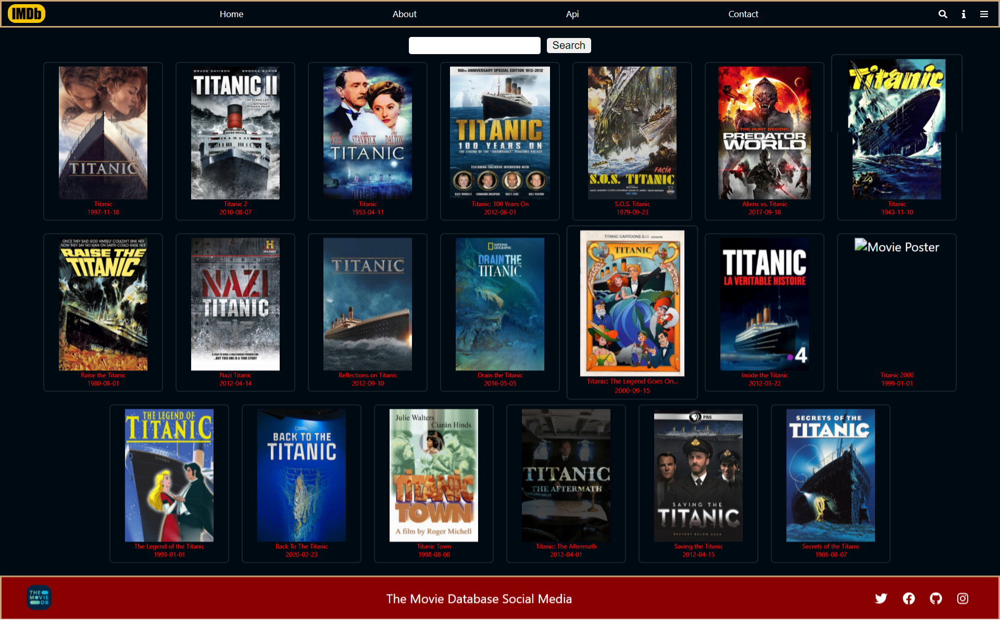
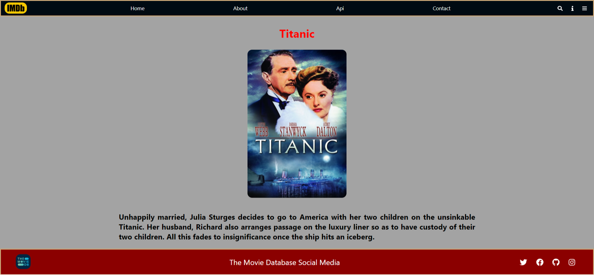

<h1 align="center">IMDB-with-React-Route-Switch-Context-useParams-</h1>

## Description

Made using Route, Switch, Context, useParams

## These are short promotional photos about this app

 

### At the end of the project, following topics are to be covered;

- HTML
- CSS
- JS
- [React](https://reactjs.org/)


## How To Use

To clone and run this application, you'll need [Git](https://git-scm.com) and [Node.js](https://nodejs.org/en/download/) (which comes with [npm](http://npmjs.com)) installed on your computer. From your command line:

```bash

$ git clone https://github.com/Talha-35/IMDB-Search-Movies-with-React.git

$ yarn install

$ yarn start
```

## PACKAGES

```bash

$ yarn add styled-components

$ yarn add node-sass

$ yarn add axios

$ yarn add @fortawesome/free-solid-svg-icons

$ yarn add @fortawesome/free-brands-svg-icons

$ yarn add @fortawesome/react-fontawesome

$ yarn add react-router-dom

```

## Contact

- GitHub [@Talha](https://github.com/Talha-35)
- Linkedin [@Talha](https://www.linkedin.com/in/talha-%C3%BClk%C3%BCmen-4854391b8/)

